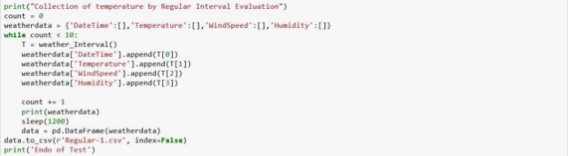
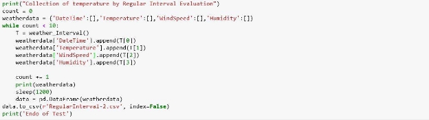
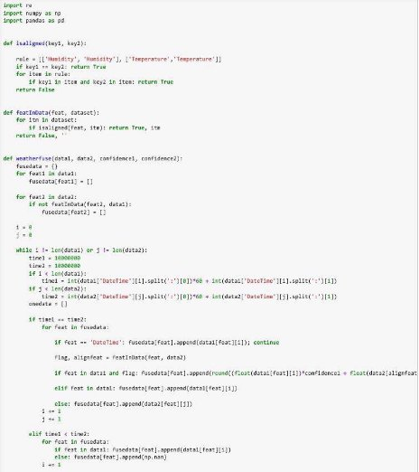
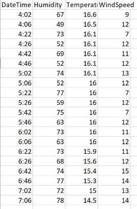
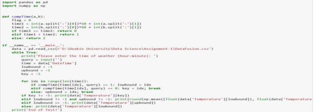
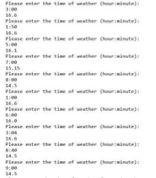

**Overview** 

This  report  was  made  by  collecting  data  from [ http://m.bom.gov.au/vic/melbourne/ ](http://m.bom.gov.au/vic/melbourne/) and [https://www.timeanddate.com/weather/australia/melbourne/ext.](https://www.timeanddate.com/weather/australia/melbourne/ext)  After  collection  of  data tables were established by Web Scrapping Tool in Python in respective CSV files. For regular Interval I took reading after the interval of every 20 minutes and for Discrete Interval, I took the reading after every 1 Celsius Temperature Change. The Respective changes can be seen under their specific headings. For Discrete, the program took 15.5 hours to collect the data whereas for Regular Interval, the program took the time of around three hours. After that we chose that which sampling is optimal. Once, it was done, than Data Integration (or Data Fusion) from two different data source takes. In end, Predictions takes place of the “Fused Data”. 

**Regular Interval**  

The *Figure 1.1* shows the values obtained from the running the Regular Interval Code (shown on *Figure 1.2.1,1.2.2, 1.2.3,1.2.4,1.2.5,1.2.6)* on the website[ http://m.bom.gov.au/vic/melbourne/.](http://m.bom.gov.au/vic/melbourne/) These Records were taken from the interval of every 20 minutes and once the values were obtained,  they  were  put  into  the  CSV  named  as  Regular-1  as  shown  on  the  Figure  1.3. Approximately, it took around 3 hours to collect 10 samples of data. 

**Note:** The Current Time is in PM. 

|**Current Time**  |**Temperature** |**Wind Speed** |**Humidity** |
| - | - | - | - |
|4:02|16.6 |9 |67 |
|4:22|16.1 |7 |73 |
|4:42|16.1 |11 |69 |
|5:02|16.1 |13 |74 |
|5:22|16 |7 |77 |
|5:42|16 |7 |75 |

|6:02|16 |11 |73 |
| - | - | - | - |
|6:22|15.9 |11 |73 |
|6:42|15.4 |15 |74 |
|7:02|15 |13 |72 |
*Figure 1.1* 

` `*Figure 1.2.1 – The Libraries required to run the program* 

*Figure 1.2.2 – Time Recording inside the Weather Interval Function*   

*Figure 1.2.3 – Code for Recording the Current Temperature from the Website*

*Figure 1.2.4-Code for Recording the Wind Speed* 

*Figure 1.2.5 – Code for Recording the Humidity*

*Figure 1.2.6 – All values were Recorded for interval of every 20 Minutes for 10 times*

*Figure 1.3* 

**Discrete Interval**  

The *Figure 2.1* shows the values obtained from the running the Discrete Interval Code (show on *Figure  2.2.1,  2.2.2,  2.2.3,  2.2.4,  2.2.5,  2.2.6)*  on  the  website [http://m.bom.gov.au/vic/melbourne/.](http://m.bom.gov.au/vic/melbourne/)  These  Records  were  taken  if  there  was  a  change  in temperature of 1 **°**C and once the values were obtained, they were put into the CSV named as Discreete.csv as shown on the *Figure 2.3*. Approximately it took around 12.5 hours to collect 10 samples of data. 

**Note**: The following time is mentioned in AM.

|**Current Time**  |**Temperature** |**Wind Speed** |**Humidity** |
| - | - | - | - |
|1:00 |8.1 |13 |30 |
|2:20 |9.1 |5 |20 |
|3:30 |10.1 |7 |10 |
|4:35 |11.1 |11 |10 |
|5:20 |13.1 |7 |5 |
|7:50 |14.1 |6 |5 |
|9:10 |15.1 |4 |10 |
|10:30 |16.1 |2 |20 |
|11:40 |17.1 |5 |30 |
|12:50 |18.1 |8 |30 |
*Figure 2.1* 

`                                `*Figure 2.2.1 – The Libraries required to run the program* 

*Figure 2.2.2 – Time Recording inside the Weather Discrete Function*  

*Figure 2.2.3 – Code for Recording the Current Temperature from the Website* 

*Figure 2.2.4-Code for Recording the Wind Speed*  

*Figure 2.2.5 – Code for Recording the Humidity* 

*Figure 2.2.6 – All values were Recorded for if there was a change of 1 Degree Celsius for 10 times*

*Figure 2.3*

**Conclusion** 

After taking the data through Regular Interval Sampling and Discrete Interval Sample, I believe that  the  Regular  Interval  Sampling  is  optimal  than  Discrete  Interval  for [http://m.bom.gov.au/vic/melbourne/.](http://m.bom.gov.au/vic/melbourne/) It is because of the following analysis. 

- It took me around 12.5 hours just to collect the Discrete Sample Data. That’s makes the average 1-2 hours just to collect the 1 degree difference in data. Ultimately, wasting valuable energy and processing power. 
- Whereas Regular Interval can provide number of samples which could be used for better analysis. 
- Larger sample set in short time, would provide precise mean and also allows researchers to  pinpoint  outliers  more  easily  ultimately  providing  better  predictions  with  high accuracy. 

**Schema Alignment** 

For  Schema  Alignment,  I  took  the  second  website  as [https://www.timeanddate.com/weather/australia/melbourne/ext.](https://www.timeanddate.com/weather/australia/melbourne/ext)  As  I  considered  Regular Interval to be the optimal one hence the following code shown on *Figure 3.1* (along with 3.1.1, 3.1.2, 3.1.3, 3.1.4, 3.1.5) was used to collect the data which was saved in CSV file as shown on Figure  3.2.  Once  the  data  was  taken,  a  schema  was  established  between  the <http://m.bom.gov.au/vic/melbourne/> and [https://www.timeanddate.com/weather/australia/melbourne/ext.](https://www.timeanddate.com/weather/australia/melbourne/ext)  Both  of  the  website consisted of Temperature and Humidity so these elements were taken as “prominent member for  establishing  a  Schema”.  I  was  already  having  the  dataset  for [http://m.bom.gov.au/vic/melbourne/ ](http://m.bom.gov.au/vic/melbourne/)   as shown on the Regular Interval Part in the  

*Figure 1.3*.Through the use of the code as shown on *Figure 3.3*, the schema was aligned to provide the following results as shown on the *Figure3.4*.   

*Figure 3.1.1 – The Libraries required to run the program*

*Figure* 3.1.2*– Time Recording inside the Weather Interval Function*** 

*Figure* *3.1.3-Code for Recording the Current Temperature from the Website*** 

*Figure 3.1.4-Code for Recording the Wind Speed*** 

*Figure 3.1.5– Code for Recording the Humidity*** 

*Figure 3.1.6 – All values were Recorded for interval of every 20 Minutes for 10 times*

*Figure 3.2* 

*Figure 3.3* 

*Figure3.4* 

**Weather Prediction** 

The values which were gained through the fusion would be used for the prediction, the following code on *Figure 4.1* could be used to achieve the result. 10 prediction were done and their results are below on *Figure 4.2*. The time is in PM, hence when the time is added along with hours: minute format, the prediction would be done. 

*Figure 4.1-Weather Prediction Code* 

*Figure 4.2- Prediction Results* 
